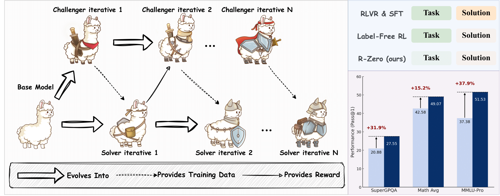

# *R-Zero*: Self-Evolving Reasoning LLM from Zero Data


## 🔥 Updates

- 

## 🏴󠁶󠁵󠁭󠁡󠁰󠁿 Overview




## ⚡️ Quickstart Guide

Getting started is easy! Just follow these steps.
### 1. Configure Environment
```bash
git clone https://github.com/Chengsong-Huang/R-Zero.git

# Navigate into the new directory
cd R-Zero
# Install the required packages
pip install -e .
# Set an environment variable for your storage path.
# This is a large directory where checkpoints and generated data will be saved.
export STORAGE_PATH="/path/to/your/storage"
export HUGGINGFACENAME="yourhuggingfacename"
```

### 2. Add API Keys

You'll need to add a few API keys to run the experiments:

* In `tokens.json`, add your API keys for **Hugging Face** and **WandB** (for logging).
* In `evaluation/results_recheck.py`, add your **OpenAI GPT** API key for evaluation.

### 3. Run the Experiments!

You can replicate all of our experimental results with a single script.

```bash
# The script takes the base model name and an abbreviation as arguments
# The abbreviation is used for creating a directory to save the model.
# Format: bash scripts/main.sh [Base_Model_Name] [Abbreviation]

# Example using Qwen/Qwen3-4B-Base:
bash scripts/main.sh Qwen/Qwen3-4B-Base qwen3-4b
```

## ❓ FAQ

### **Q: What is the hardware setup for the experiments?**

**A:** All our experiments were conducted on an 8-GPU server, using models that can run on a single GPU (e.g., 4B or 8B). If you need to run experiments under different conditions, such as with larger models or different hardware, you will need to modify the code accordingly.


### **Q: What should I do if I encounter environment configuration issues during installation?**

**A:** Our framework's structure is inspired by [EasyR1](https://github.com/hiyouga/EasyR1/tree/main). If you run into any environment-related issues, we highly recommend checking out their setup instructions or using their Docker environment as a reference.

### **Q: Where are the training logs and model checkpoints saved?**

**A:** All generated data, including logs, datasets, and model checkpoints, will be saved in the directory you set via the `STORAGE_PATH` environment variable. Also dataset will be sent to huggingface via `HUGGINGFACENAME`.

### **Q: What if the code gets stuck during the questioner training process?**

**A:** This is likely due to a strange bug in the `math_verify` lib, which can cause an infinite loop when processing certain answers. We've added a timeout control to mitigate this, but it may not catch all cases. If you encounter this issue, please just restart the training from the last saved checkpoint.

## 🙏 Acknowledgements

Our framework is directly based on the great work of [**EasyR1**](https://github.com/hiyouga/EasyR1/tree/main), implementing all of its core functionalities. Additionally, our evaluation process heavily referenced the work from [**General-Reasoner**](https://github.com/TIGER-AI-Lab/General-Reasoner). We are very grateful for their excellent work. We would also like to thank all collaborators.

## 💬 Citation
If our work is useful for you, please consider citing our paper:
```
```